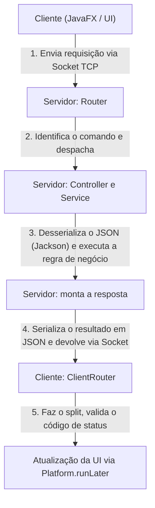

# Sistema VaiJunto — Plataforma de Caronas Universitárias


## Visão Geral e Contexto Acadêmico

O **VaiJunto** é um sistema distribuído de compartilhamento de caronas universitárias, desenvolvido com foco na aplicação prática de redes de computadores, sistemas distribuídos e programação concorrente. O desafio arquitetural central do projeto é a proibição do uso de Sistemas de Gerenciamento de Banco de Dados (SGBDs) externos e de frameworks de comunicação remota (RPC/Spring).

Toda a comunicação é baseada em **Sockets TCP/IP puros**, com protocolo de transporte customizado e serialização via JSON. O controle de concorrência (evitando *overbooking*) é feito inteiramente em memória RAM, utilizando estruturas de sincronização avançadas do Java. O sistema também permite a combinação automática de trechos de múltiplos motoristas (baldeações), usando algoritmos de Teoria dos Grafos.

---

## Requisitos e Perfis de Usuário

O sistema atende a dois perfis principais de usuários.

### Cliente Motorista

- **Autenticação:** login seguro no sistema via Socket.
- **Publicar carona:** cadastro de rotas contínuas (origem e destinos intermediários), data, horário, número de assentos e valor por trecho.
- **Consultar publicações:** listagem das caronas oferecidas pelo motorista.
- **Visualizar ocupação:** inspeção da lista de passageiros confirmados, segmentada por trecho da viagem.
- **Cancelamento:** desativação de uma carona, alterando o status e liberando recursos (*soft delete*).

### Cliente Passageiro

- **Autenticação:** acesso à plataforma.
- **Busca de itinerários:** informar origem, destino e data; o servidor calcula rotas diretas ou combinadas (baldeação entre carros diferentes).
- **Reserva atômica:** confirmação de assentos em um itinerário, respeitando o princípio atômico (tudo ou nada) em todos os trechos envolvidos.
- **Painel de reservas:** consulta ao histórico e status das reservas ativas.
- **Cancelamento:** desistência da vaga, devolvendo o assento à disponibilidade global.

---

## Fundamentação Teórica

1. **Redes e comunicação TCP/IP** — o sistema opera via Sockets TCP, garantindo entrega ordenada, íntegra e sem perdas de pacotes. O servidor orquestra as conexões em um `ExecutorService` (thread pool), isolando os fluxos: se um cliente cair abruptamente (`SocketException`), o servidor principal continua rodando normalmente, sem corromper transações.
2. **Concorrência e transações atômicas** — na ausência de bancos relacionais, o risco de condição de corrida (*race condition*) ao reservar a mesma vaga é tratado com locks, blocos `synchronized` e validação em duas fases. A transação só debita a vaga se todos os trechos do percurso tiverem disponibilidade no momento exato da efetivação. Coleções thread-safe (`ConcurrentHashMap`, `CopyOnWriteArrayList`) garantem leitura isolada por outras threads em tempo real.
3. **Teoria dos grafos** — a malha viária é modelada como um grafo direcionado, no qual os vértices representam cidades e as arestas equivalem aos trechos de carona publicados.

---

## Arquitetura do Sistema

A base de código é estruturada em módulos isolados sob gerenciamento do Maven (multi-module), garantindo baixo acoplamento:

- **Módulo `Shared`** — contém DTOs, enums e o núcleo do protocolo customizado; encapsula os dados agnósticos de infraestrutura.
- **Módulo `Server`** — responsável pelas conexões Socket, thread pools, controllers, services e orquestração da busca. Implementa a persistência em disco (arquivos `.json`) via `FileManager`.
- **Módulos `Client` e `Custom`** — views e controllers gráficos em JavaFX. Atuam de forma passiva, requisitando dados assincronamente sem travar a thread de renderização da UI (`Platform.runLater`).

### Protocolo Customizado de Comunicação (ServerGrammar)

A serialização mapeia as requisições em strings delimitadas por `|` (pipe), enviadas pela rede seguindo a sintaxe:

```text
TIPO_COMANDO | PAYLOAD_JSON | TOKEN_SESSAO | TAMANHO
```

---

## Módulo de Roteamento e Composição de Trechos

Para combinar roteiros entre motoristas diferentes, o sistema emprega o algoritmo BFS (Busca em Largura):

1. **Geração dinâmica** — ao receber uma solicitação de busca, o servidor avalia o catálogo de caronas ativas e cria grafos temporários apenas para caronas abertas e com vagas.
2. **Travessia (BFS)** — o grafo é percorrido camada por camada, garantindo que os primeiros itinerários validados tenham a menor quantidade possível de baldeações.
3. **Filtro estrito** — rotas em que as caronas subsequentes partem antes da chegada do passageiro, ou que quebram a continuidade espaço-temporal, são descartadas automaticamente.

---

## Especificação de Hardware e Software

- **Linguagem:** Java 17 ou superior (imagem base dos containers: `maven:3.9-eclipse-temurin-24`).
- **Gerenciador de dependências:** Apache Maven 3.9+.
- **Interface gráfica:** JavaFX.
- **Virtualização e DevOps:** Docker, Docker Compose e WSL 2 (Windows Subsystem for Linux).
- **Dependências de ambiente (cliente em Linux/Docker):** bibliotecas gráficas X11/GTK (`libx11-6`, `libgtk-3-0`, `libgl1`, entre outras), necessárias para renderizar as janelas do JavaFX de dentro do container.
- **Rede:** o servidor escuta na porta `2602`, mapeada em `compose.yaml`; o container do cliente localiza o servidor pelas variáveis de ambiente `SERVER_IP` e `SERVER_PORT`.

---

## Instalação e Configuração

O ecossistema é orquestrado via Docker Compose (`compose.yaml`, combinado automaticamente com `compose.windows.yaml` ou `compose.linux.yaml` conforme o sistema operacional), com o auxílio de um Makefile que detecta o SO e seleciona os arquivos corretos.

### 1. Preparação (recomendado para Windows)

Clone e opere o projeto diretamente no sistema de arquivos do WSL (`~/projetos/VaiJunto`), e não no diretório NTFS (`/mnt/c/...`), para evitar atrasos de I/O e problemas com *bind-mounts* órfãos no Docker Desktop.

### 2. Permissão do display gráfico (Linux)

No Linux nativo, o container do cliente acessa o display X do host via `/tmp/.X11-unix` (montado por `compose.linux.yaml`). Antes de subir o cliente, é preciso liberar o acesso ao servidor X local:

```bash
xhost +local:
```

Sem esse comando, o container não tem permissão para abrir a janela do JavaFX no host.

### 3. Subindo a solução via Makefile

```bash
# Build das imagens e subida de Servidor + Cliente com hot-reload (nodemon)
make up-build

# Alternativa: apenas builda as imagens, sem subir os containers
make build
```

Também é possível operar cada módulo separadamente:

```bash
make server-build     # builda e sobe apenas o Servidor
make client-build     # builda e sobe apenas o Cliente (JavaFX GUI)
```

Outros comandos úteis do Makefile:

```bash
make down             # para e remove os containers
make restart          # down seguido de up --build
make logs             # acompanha os logs do Servidor
make clean            # mvn clean dentro do container do Servidor
make clean-install    # mvn clean install dentro do container do Servidor
make docker-start     # inicia o serviço Docker (systemctl)
make docker-status    # verifica o status do serviço Docker
```

Para o Cliente, é necessário um servidor X em execução na máquina hospedeira (como VcXsrv ou GWSL no Windows, ou o X11 padrão no Linux).

---

## Dockerfiles

O projeto inclui dois Dockerfiles dedicados, descritos em `Docker/Server/Dockerfile` e `Docker/Client/Dockerfile`:

- **Servidor** — compila o backend sem dependências gráficas e executa `mvn install -pl Server exec:java` diretamente (sem hot-reload).
- **Cliente** — inclui as bibliotecas gráficas X11/GTK necessárias para rodar o JavaFX dentro do container, e mantém o `nodemon` monitorando `Client/src`, `Custom/src` e `Shared/src`; a cada alteração, reexecuta `mvn install -pl Client -am -DskipTests` seguido de `mvn -pl Client javafx:run`.

---

## Diagrama de Fluxo de Mensagens



Detalhamento das etapas:

- **Envio da requisição (Cliente):** o cliente inicia a comunicação enviando os dados formatados pela rede via Socket TCP.
- **Recepção e roteamento (Servidor):** o `Router` intercepta a mensagem bruta e mapeia o comando recebido para o `Controller` adequado.
- **Processamento (Servidor):** o `Controller` converte o JSON em objetos usando Jackson e repassa o fluxo ao `Service`, que executa a regra de negócio (busca em grafos, transações atômicas, etc.).
- **Geração e envio da resposta (Servidor):** o resultado é serializado novamente em JSON, encapsulado em um objeto de resposta e enviado de volta pelo socket.
- **Processamento no Cliente (`ClientRouter`):** o cliente recebe a resposta bruta, faz o split da mensagem, analisa o código de status e despacha o resultado para a UI de forma segura, na thread correta, via `Platform.runLater`.

---

## Testes Automatizados e Confiabilidade

Para validar a atomicidade do backend e a ausência de corrupção de memória, o projeto conta com um roteiro de testes de alta carga:

- **`ClientTest`** — simula um cadastro e uma requisição de cliente para o servidor.
- **`ReservaStressTest`** — simulador que gera tráfego de rede, instanciando múltiplos Sockets cliente em paralelo.
- **Prevenção de overbooking** — dezenas de clientes disputam simultaneamente uma única vaga disponível.
- **Resultado esperado** — graças ao bloqueio síncrono com checagem em duas fases, apenas um cliente recebe a resposta de sucesso (status 200); os demais recebem a resposta `CARONA_LOTADA`, comprovando a ausência de condições de corrida.

---

## Equipe de Desenvolvimento

- **Autor(es):** Taylon Luis do Nascimento Cerqueira
- **Instituição:** Universidade Estadual de Feira de Santana (UEFS).
- **Disciplina:** MI - Concorrência e Conectividade.
